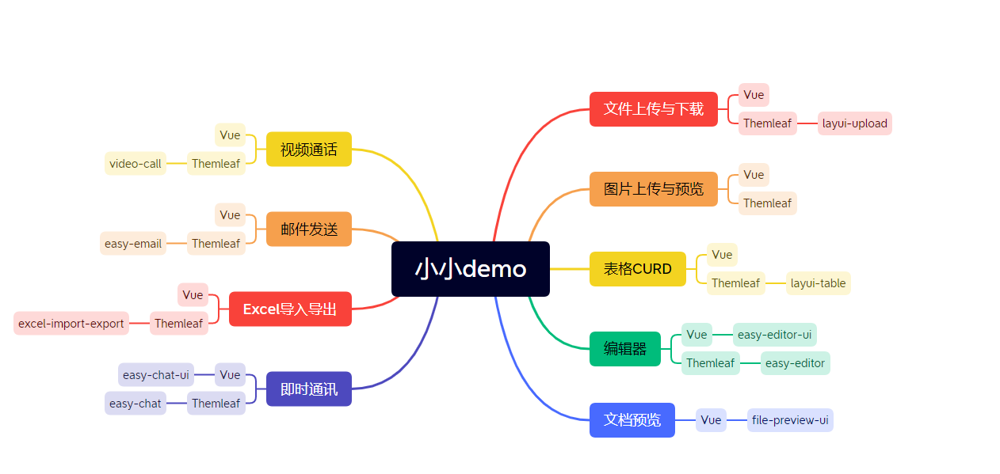

> 总览图

# 合集

## 登录

|             工程名             | 简介                    | 是否已完成 | 演示链接                                                     |
|:---------------------------:|:----------------------|:-----:|:---------------------------------------------------------|
|        🐯 easy-login        | 基于Session登录           |   是   | [B站](https://www.bilibili.com/video/BV1co4y137Hq/)|
| 🐷 easy-login-session-share | 基于Session共享登录         |   否   | 待发布                                                      |

## 扫码登录

|             工程名             | 简介                    | 是否已完成 | 演示链接                                                                |
|:---------------------------:|:----------------------|:-----:|:--------------------------------------------------------------------|
|  🐡 layui-scan-code-login   | 扫码登录                  |   否   | 待发布                                                                 |

## 编辑器

|             工程名             | 简介                    | 是否已完成 | 演示链接                                                                |
|:---------------------------:|:----------------------|:-----:|:--------------------------------------------------------------------|
|       🐨 easy-editor        | 编辑器<HTML>             |   是   | [easy-editor ](https://www.bilibili.com/video/BV1KT411871U/)        |
|      🐨 easy-editor-ui      | 编辑器<VUE版本>            |   否   |         |

## 邮件发送

|             工程名             | 简介                    | 是否已完成 | 演示链接                                                       |
|:---------------------------:|:----------------------|:-----:|:-----------------------------------------------------------|
|        🐖 easy-email        | QQ邮件发送                |   是   | [B站](https://www.bilibili.com/video/BV1pM4y1e76F/)  [抖音](https://v.douyin.com/UvrajgJ/) |

## Excel文件导入导出

|             工程名             | 简介                    | 是否已完成 | 演示链接                                                      |
|:---------------------------:|:----------------------|:-----:|:----------------------------------------------------------|
|   🌸 excel-import-export    | Excel导入导出             |   是   | [B站](https://www.bilibili.com/video/BV1r24y1T73f/) [抖音](https://v.douyin.com/Uvh8yjU/ ) |

## 在线聊天

|             工程名             | 简介           | 是否已完成 | 演示链接                                                                |
|:---------------------------:|:-------------|:-----:|:--------------------------------------------------------------------|
|         ☀️easy-chat         | 简单的在线聊天      |   是   | [easy-chat](https://www.bilibili.com/video/BV1TM4113796/)           |
|    ❄️easy-chat-by-voice     | 在线聊天集成语音发送   |   否   | 待发布                                                                 |
|      🌀 easy-chat-room      | 在线聊天室        |   是   | 待发布                                                                 |
|    ☁️ easy-chat-room-ui     | 在线聊天室<VUE版本> |   是   | 待发布                                                                 |
|       ⚡️ easy-chat-ui       | 简单的在线聊天<Vue> |   是   | 待发布                                                                 |

> 更新日志

- 2023-06-13 easy-chat 新增文字转语音效果

## 视频通话

|        工程名         | 简介                  | 是否已完成 | 演示链接                                                                                                |
|:------------------:|:--------------------|:-----:|:----------------------------------------------------------------------------------------------------|
|   🌰 video-call    | 网页视频通话（一对一）         |   是   | [video-call](https://www.bilibili.com/video/BV1vP41117pu/)                                          |
| 🌰 video-call-many | 多人视频通话（会议、直播）       |   是   | [🌰视频会议-抖音](https://v.douyin.com/Uv67X3S/)  [🌰视频会议-B站](https://www.bilibili.com/video/BV1jN411k7us/)   |
|  🌰 video-call-ui  | 网页视频通话（Vue版本-会议、直播） |   是   | [🌰一对一视频-抖音](https://v.douyin.com/UvML7WD/)  [🌰一对一视频-B站](https://www.bilibili.com/video/BV1Po4y1J7Qa/) |

## 文件上传与下载

|             工程名             | 简介              | 是否已完成 | 演示链接                                                                |
|:---------------------------:|:----------------|:-----:|:--------------------------------------------------------------------|
|       🌿 layui-upload       | 基于layui的上传、下载文件 |   是   | [layui-upload](https://www.bilibili.com/video/BV1Zo4y1T7d1/)                                                    |
|     🌹 file-preview-ui      | 上传、下载、预览文件      |   是   | [file-preview-ui ](https://www.bilibili.com/video/BV1Zo4y1T7d1/)    |
|     🌹 layui-upload-big-file      | 大文件上传（分片上传）     |   否   | 待发布   |

## 增删改查

|             工程名             | 简介                    | 是否已完成 | 演示链接                                                                |
|:---------------------------:|:----------------------|:-----:|:--------------------------------------------------------------------|
|       🍁 layui-table        | 基于layui table 表格 增删改查 |   否   | [B站]() ,[抖音]()                                                               |
|       🌴 vue-table-ui       | 表格增删改查<Vue>           |   是   | [B站]() ,[抖音]()                                                    |

## 通知公告

|             工程名             | 简介                    | 是否已完成 | 演示链接                                                                |
|:---------------------------:|:----------------------|:-----:|:--------------------------------------------------------------------|
|       🌷 layui-notice       | 公告（个人、所有人、定时、登录通知）    |   否   | [B站]() ,[抖音]()                                                                 |

## 树形结构

|             工程名             | 简介        | 是否已完成 | 演示链接                                                            |
|:---------------------------:|:----------|:-----:|:----------------------------------------------------------------|
|       🍄 easy-tree        | 基于HTML树结构 |   否   | [B站]() ,[抖音]()                                                  |
|       🍄 vue-tree-ui        | 基于VUE树结构  |   否   | [B站]() ,[抖音]()                                                  |

## Echart图表

|       工程名       | 简介             | 是否已完成 | 演示链接                                                                |
|:---------------:|:---------------|:-----:|:--------------------------------------------------------------------|
| ☀️layui-echart  | Echart图表《HTML》 |   否   |   [B站]() ,[抖音]()       |
| ☀️vue-echart-ui | Echart图表《VUE》  |   否  |    [B站]() ,[抖音]()       |

## 留言回复

|             工程名             | 简介                    | 是否已完成 | 演示链接                                                                |
|:---------------------------:|:----------------------|:-----:|:--------------------------------------------------------------------|
|   🌻 layui-leave-comments   | 留言                    |   否   | [B站]() ,[抖音]()                                                                |

## 城市定位

|             工程名             | 简介            | 是否已完成 | 演示链接           |
|:---------------------------:|:--------------|:-----:|:---------------|
|   🌻 easy-request-location   | IP地址获取城市定位信息 |   是   | [B站]() ,[抖音]() |

## 监控

|             工程名             | 简介                | 是否已完成 | 演示链接 |
|:---------------------------:|:------------------|:-----:|:-----|
|   🌻 easy-request-location   | easy-sys-monitor  |   是   | 待发布  |
|   🌻 easy-sys-log-monitor   | 服务日志监控            |   是   | 待发布  |
|   🌻 easy-sys-log-monitor-ui   | 服务日志监控前端《VUE》     |   是   | 待发布  |

# 相关官网

[Layui](http://layui.dotnetcms.cn/web/index.htm)

[Element-ui](https://element.eleme.cn/#/zh-CN)