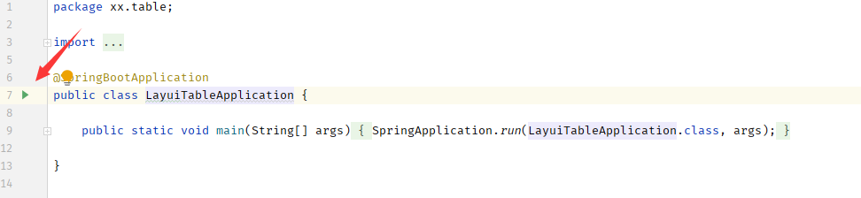
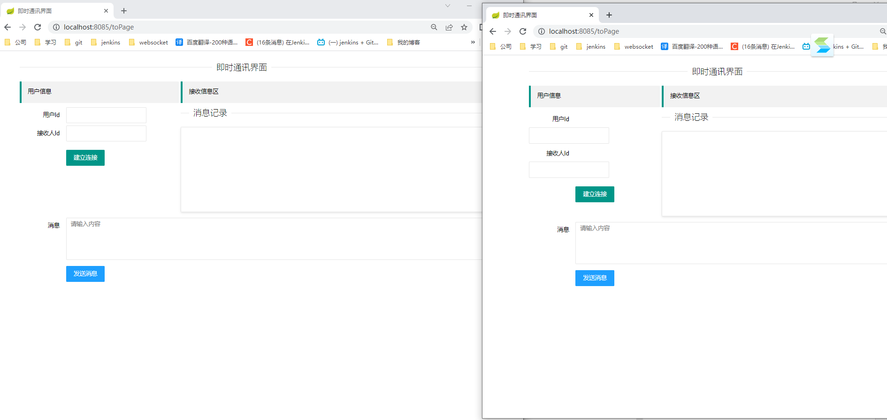
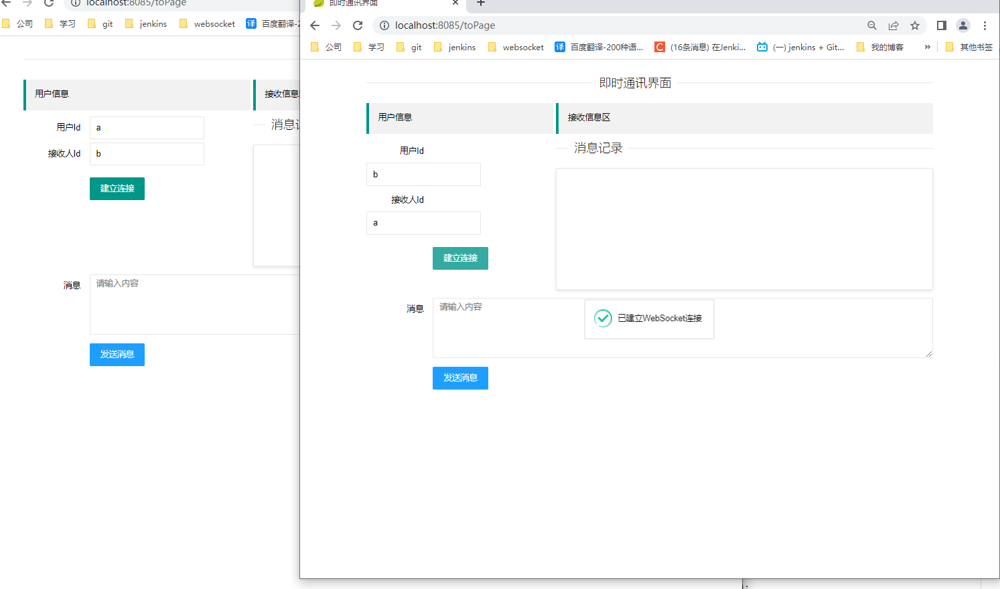
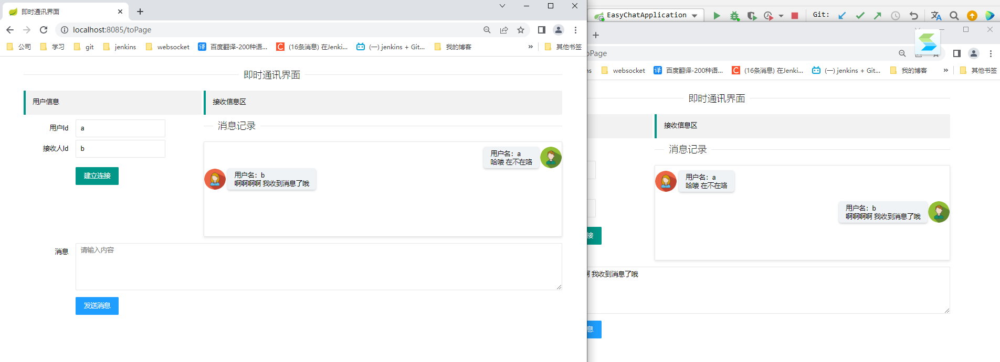

~~# easy-chat

一个简单的即时通讯demo。

## 环境

- jdk1.8
- idea
- maven
- springboot 2.1.1.RELEASE
- websocket

## 项目启动

### 修改maven设置

打开IDEA 设置：File>Setting>Build,Exec... 如下图所示

### 启动

找到启动类，鼠标右键点击三角形或`虫` 即可；

> 访问路径：

http://localhost:8085/toPage

## 使用手册

> 打开两个页面：

如下所示：

输入你的用户ID 和对方的ID 点击建立连接。

> 效果如下所示

双方都建立连接后，就可以互相发送消息啦。

> 互发消息

# 演示地址

B站： https://b23.tv/CGctkMe

# 项目地址 

Gitee: https://gitee.com/HelloWangXianLin/xiaoxiao-demo.git

在easy-chat下哦。

**目前仅做了一个 发送文本的，如需要新增其他内容，请留言哈，**~~

