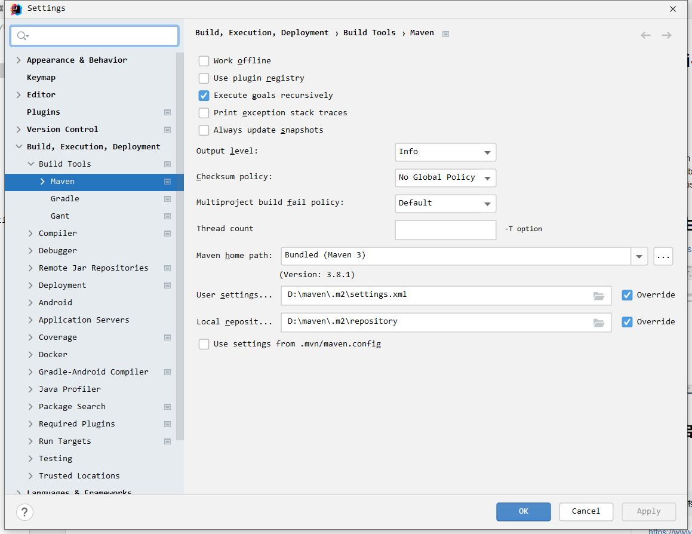

~~# easy-chat

一个简单的即时通讯demo。

## 环境

- jdk1.8
- idea
- maven
- springboot 2.1.1.RELEASE
- websocket

## 项目启动

### 修改maven设置

打开IDEA 设置：File>Setting>Build,Exec... 如下图所示

### 启动

找到启动类，鼠标右键点击三角形或`虫` 即可；

> 访问路径：

http://localhost:8085/toPage

## 使用手册

> 打开两个页面：

如下所示：

输入你的用户ID 和对方的ID 点击建立连接。

> 效果如下所示

双方都建立连接后，就可以互相发送消息啦。

> 互发消息

# 演示地址

B站： https://b23.tv/CGctkMe

# 项目地址

Gitee: https://gitee.com/HelloWangXianLin/xiaoxiao-demo.git

在easy-chat下哦。

**目前仅做了一个 发送文本的，如需要新增其他内容，请留言哈，**~~

# 文字转语音

SpeechSynthesisUtterance()函数 函数目前处于实验性阶段，在使用它之前，请仔细检查浏览器兼容性表。

| 属性 | 说明  |
|----|-----|
| text   | 要合成的文字内容，字符串    |
| lang   | 使用的语言，字符串， 例如：“zh-cn”    |
| voiceURI   |  指定希望使用的声音和服务，字符串   |
| volume   | 声音的音量，区间范围是0到1，默认是1    |
| rate   | 语速，数值，默认值是1，范围是0.1到10，表示语速的倍数，例如2表示正常语速的两倍。    |
| pitch   | 表示说话的音高，数值，范围从0（最小）到2（最大）。默认值为1    |

> speechSynthesis属性

- SpeechSynthesis.paused 只读 当SpeechSynthesis 处于暂停状态时， Boolean 值返回 true 。

- SpeechSynthesis.pending 只读 当语音播放队列到目前为止保持没有说完的语音时， Boolean 值返回 true 。

- SpeechSynthesis.speaking 只读 当语音谈话正在进行的时候，即使SpeechSynthesis处于暂停状态， Boolean 返回 true。

