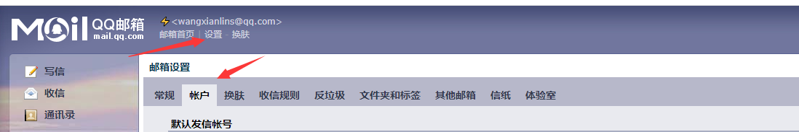
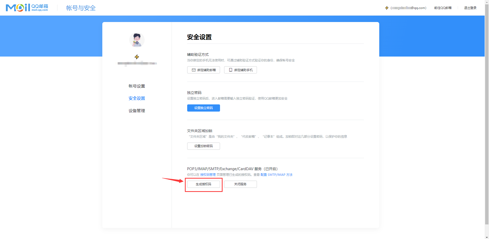
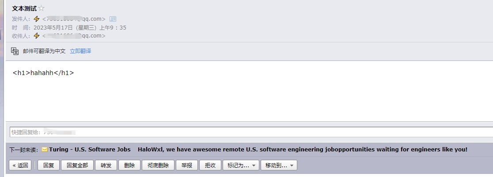

# easy-mail

集成 QQ 邮箱 发送邮件。


## QQ邮箱 授权码

地址：https://mail.qq.com/

找到邮箱设置->账户->开启服务-> 获取授权码

> 操作步骤

如下图所示：






## 核心依赖

```xml
    <dependency>
        <groupId>org.springframework.boot</groupId>
        <artifactId>spring-boot-starter-mail</artifactId>
    </dependency>
    <dependency>
        <groupId>org.springframework.boot</groupId>
        <artifactId>spring-boot-starter-freemarker</artifactId>
    </dependency>
```

## 修改项目配置

```yml
# 服务端口配置
server:
  port: 8089


spring:
  # 邮箱配置
  mail:
    host: smtp.qq.com
    port: 587
    username: 你的邮箱地址
    password: 授权码
    # 编码
    default-encoding: UTF-8
    properties:
      mail:
        smtp:
          socketFactoryClass: javax.net.ssl.SSLSocketFactory
  # thymeleaf 模板配置
  thymeleaf:
    #模板的模式，支持 HTML, XML TEXT JAVASCRIPT
    mode: HTML5
    #编码 可不用配置
    encoding: UTF-8
    #内容类别,可不用配置
    content-type: text/html
    #开发配置为false,避免修改模板还要重启服务器
    cache: false
    #    #配置模板路径，默认是templates，可以不用配置
    prefix: classpath:/templates
    suffix: .html


send:
  from: 你的邮箱地址
  authCode: 授权码
  sendMail: 你的邮箱地址
```

## 启动项目

访问：http://localhost:8089/mail/

## 测试

### 发送文本





### 发送HTML


### 发送附件+文本


### 按模板发送

> 模板如下所示：

传递相应的参数给模板的字段赋值即可。

```ftl
<!DOCTYPE html>
<html lang="en">
<head>
  <meta charset="UTF-8">
  <title>Title</title>
</head>
<body>
<p>hello 欢迎加入大家庭，您的入职信息如下：</p>
<table border="1">
  <tr>
    <td>姓名</td>
    <td style="font-size: 30px;font-weight: bold">${name}</td>
  </tr>
  <tr>
    <td>工号</td>
    <td>${num}</td>
  </tr>
  <tr>
    <td>薪水</td>
    <td>${salary}</td>
  </tr>
</table>
<div style="color: dodgerblue">一起努力创造辉煌</div>
</body>
</html>
```


# 项目地址

[xiaoxiao-demo](https://gitee.com/HelloWangXianLin/xiaoxiao-demo )

在【easy-mail】工程下。

> 麻烦大佬，动动小手，点个小心心，在下感激不尽。


