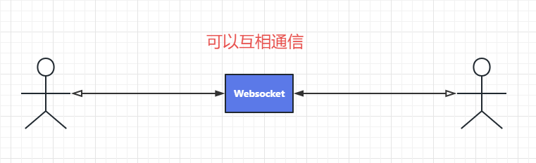
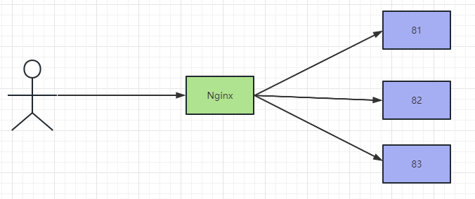
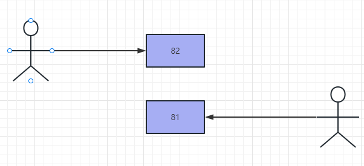
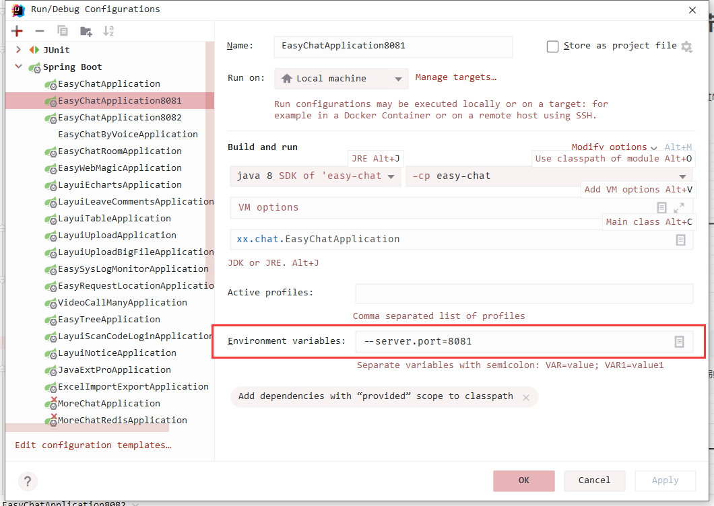
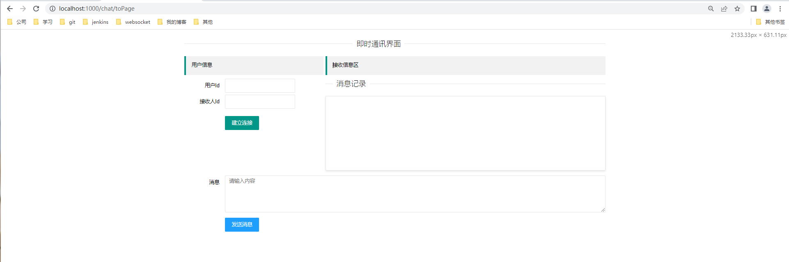
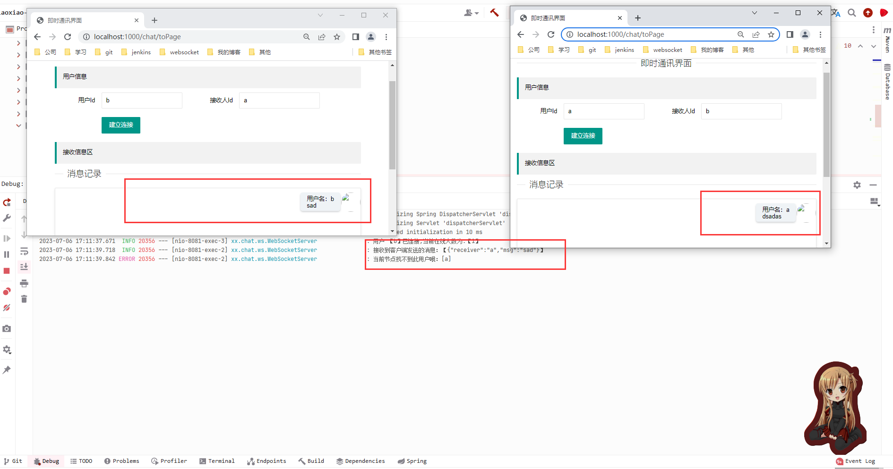

# Websocket 多节点情况下消息收发

## 单节点



## 问题抛出

本地启动 两个websocket 端，通过Nginx代理。

如下所示：



> 问题

如果两个客户端通过NG代理的 分别连接在不同的节点上，如下所示：



当A给82发送消息给B时，由于B连接在81上，82上无法找到B，故消息无法推送给B ,因为两个客户端，不在同一个节点上。

## 演示一下子

使用IDEA启动两个客户端 分别为8081 和 8082。



在这里指定启动的端口哦。

启动完成后 通过NG代理，配置如下所示:

```text
  upstream chat {
    	server localhost:8081;
    	server localhost:8082;
    }

  ## server 里面的配置哦  
  location ~ /chat/ {
            proxy_pass  http://chat;
            proxy_http_version 1.1;
       	 	proxy_set_header Upgrade $http_upgrade;
        	proxy_set_header Connection "upgrade";
        }
```

NG 端口为 1000

故：访问地址为-> localhost:1000/chat/toPage


**注意： Nginx代理Websocket时，需要将协议升级哦，不然会导致Websocket连接不上。**




**问题来了**

消息接收不到！Oh GG。



# 解决方案

## 基于Redis的消息订阅与发布

即：客户端订阅同一个主题，发送消息的时候，将消息发送到对应的主题。


## MQ 消息中间件


### 基于RabbitMQ

首先，我们需要了解一下rabbitmq 相关的一些知识。

rabbitmq 它有四种


### 基于RocketMQ

首先，我们需要了解一下rocketmq 相关的一些知识。

rocketMQ 有两种模式 一种是集群模式，一种是广发模式。
