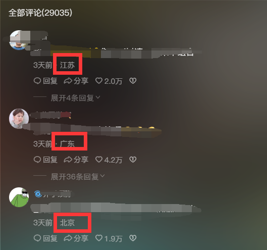
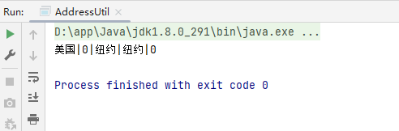

# 获取用户请求访问地城市

大家可以看到抖音、小红书上 会有这样的城市信息

如下所示：




所以今天给大家推荐一个框架 ip2region。

# ip2region

[GitHub下载地址](https://github.com/lionsoul2014/ip2region)

## 下载项目

将文件'ip2region.xdb','global_region.csv','ip.merge.txt'加下文件拷贝到'resources'目录下.

## 引入依赖

```xml
<!-- ip2region  -->
<dependency>
	<groupId>org.lionsoul</groupId>
	<artifactId>ip2region</artifactId>
    <version>2.6.3</version>
</dependency>
<!-- 用于读取ip2region.xdb文件使用 -->
<dependency>
	<groupId>commons-io</groupId>
	<artifactId>commons-io</artifactId>
	<version>2.6</version>
</dependency>
```

## 写一个测试类 

```java
package xx.location.util;

import org.lionsoul.ip2region.xdb.Searcher;

import java.util.Objects;

public class AddressUtil {
    /**
     * 根据IP地址查询登录来源
     *
     * @param ip
     * @return
     */
    public static String getCityInfo(String ip) {
        try {
            // 获取当前记录地址位置的文件
            String dbPath = Objects.requireNonNull(AddressUtil.class.getResource("/data/ip2region.xdb")).getPath();
            //创建查询对象
            Searcher searcher = Searcher.newWithFileOnly(dbPath);
            //开始查询
            return searcher.searchByStr(ip);
        } catch (Exception e) {
            e.printStackTrace();
        }
        //默认返回空字符串
        return "";
    }

    public static void main(String[] args) {
        System.out.println(getCityInfo("68.174.252.207"));
    }
}
```

> 测试结果




