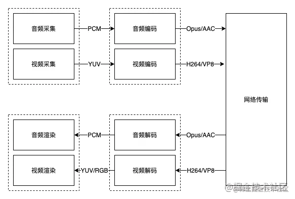

# video-call

一个简单的 音视频通话 demo，包含：视频、麦克风、屏幕共享操作。

## 项目环境

- jdk1.8
- idea
- maven
- springboot 2.1.1.RELEASE
- websocket

## 项目启动

### 修改maven设置

打开IDEA 设置：File>Setting>Build,Exec... 如下图所示


### 启动


找到启动类，鼠标右键点击三角形或`虫` 即可；


> 访问路径：

http://localhost:8086/toPage

如果需要在局域网内访问，需要配置整数，使用HTTPS访问。
> HTTPS访问路径：

https://局域网IP地址:8086/toPage

本项目只需要修改 `application.yml`文件下

```yml

# 服务端口配置
server:
  port: 8086
  # 配置 Https 证书
  ssl:
    key-store: classpath:keystore.jks
    key-store-password: kurento
    key-store-type: JKS
    key-alias: kurento-selfsigned
```

## 使用手册

### 本地访问

#### 启动界面


#### 注册


#### 呼叫


#### 视频通话


#### 打开、关闭视频


#### 打开、关闭麦克风


#### 屏幕分享


### 局域网内访问 

仅访问地址不同，其他功能一致。

# WebRtc 

参考：如何实现一个基于WebRTC的音视频通信系统: https://juejin.cn/post/7169557366587785229

## WebRTC架构

> 简单的音视频架构



> WebRTC架构


WebRTC大体可以分为四层：接口层、Session层、引擎层、设备层：

接口层：暴露给业务侧，业务侧可以使用原生的 C++ API 接口或者 Web API 开发音视频实时通信。核心是 RTCPeerConnection

Session层：用于控制业务逻辑，比如媒体协商、收集 Candidate 等

引擎层：包括音频引擎、视频引擎和网络传输

设备层：主要和硬件交互，负责音频的采集和播放，视频的采集，物理网络等

## 音视频通信过程


一个正常音视频通信架构如上图所示，通信双方分别是 caller（主叫） 与 callee（被叫），两边的内部逻辑相似，下面以caller端为例，了解内部流程：

调用音视频检测模块，检测终端是否有可用的音视频设备

调用音视频采集模块，采集用户音视频数据

根据用户选择，是否开启录制（授权）

通过信令模块交换SDP

创建WebRTC的核心对象RTCPeerConnection，之后添加采集到的音视频数据

RTCPeerConnection向STUN(SessionTraversal Utilities forNAT)/TURN(Traversal Using Relays aroundNAT)服务器发送请求，返回caller的外网ip地址和端口号

通过信令服务器，caller和callee互相传递对方的外网ip地址和端口（媒体协商）

最终P2P链接建立完成，后面就会源源不断的发送音视频数据到对端

## 协商流程


# 项目地址

Gitee: https://gitee.com/HelloWangXianLin/xiaoxiao-demo.git

在video-call下哦。


