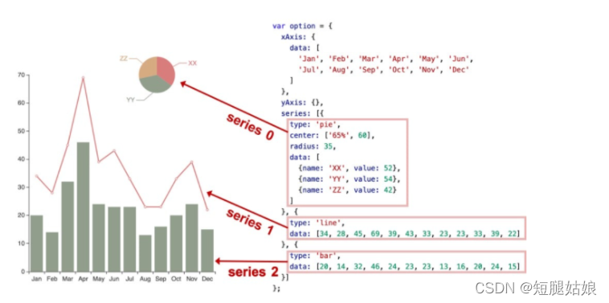
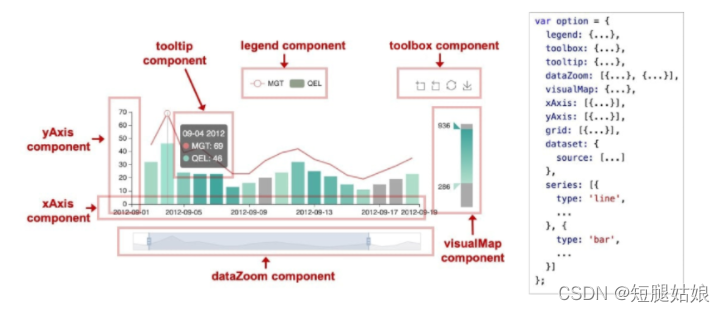
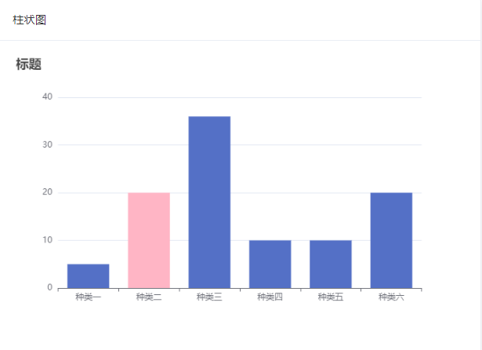
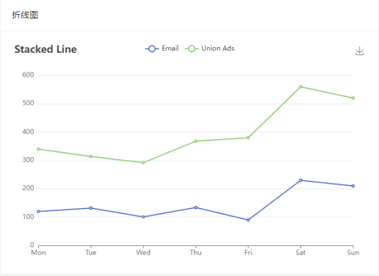

# vue-echart-ui

vue 集成 echart 图表的小 demo。

# 基础

> series.type

包括：line（折线图）、bar（条形图）、pie（饼图）、scatter（散点图）、graph（图形图）、tree（树状图）等

> series.data

在每个系列中声明：option



> series.data

echarts包括这些组件：xAxis（笛卡尔坐标系的x轴）、yAxis（笛卡尔坐标系的y轴）、grid（笛卡尔坐标系的底板）、angleAxis（极坐标系的角度轴） , 
radiusAxis（极坐标系的半径轴），polar（极坐标系的底板），geo（GEO坐标系），dataZoom（改变数据显示范围的组件），visualMap（指定视觉对象的组件）映射），
tooltip（工具提示组件）、toolbox（工具箱组件）、series




# 集成步骤

## 安装

```shell
npm install echarts --save
```
## 引用 
在main.js 里面引用

```js
import * as echarts from 'echarts'
//局部或全局定义
Vue.prototype.$echarts = echarts
```

# 页面效果

## 静态效果

### code 以饼图为例

```vue

<div id="pie" style="width: 100%;height: 400px;"></div>

<script>
export default {
  /**
   * 柱状图
   */
  barEcharts() {
    var myChart = this.$echarts.init(document.getElementById('bar'))
// 配置图表
    var option = {
      title: {
        text: '标题'
      },
//提示框
      tooltip: {},
      legend: {
        data: ['']
      },
//x轴显示种类
      xAxis: {
        data: ['种类一', '种类二', '种类三', '种类四', '种类五', '种类六']
      },
//y轴可填数值等
      yAxis: {},
      series: [{
        name: '销量',
        type: 'bar',
//y轴数值
        data: [5,
          {
            value: 20,
            itemStyle: {
              color: '#FFB5C5'
            }
          }, 36, 10, 10, 20]
      }]
    }
    myChart.setOption(option)
  }
}
</script>
```

**注意**
需要放在 mounted 。
```vue
mounted() {
    this.pieEcharts();
  }
```

### 页面效果

#### 柱状图



#### 饼图


#### 折线图


## 动态效果

后续更新...

# 项目地址

Gitee:[xiaoxiao-demo](https://gitee.com/HelloWangXianLin/xiaoxiao-demo.git) 的vue-echart-ui下。需配合layui-echarts 后端接口使用。