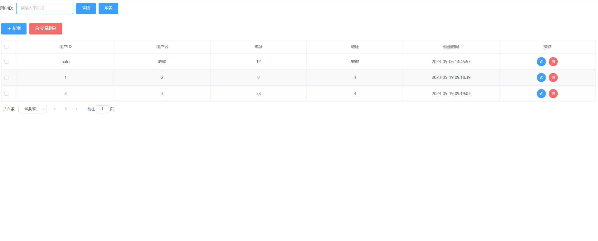
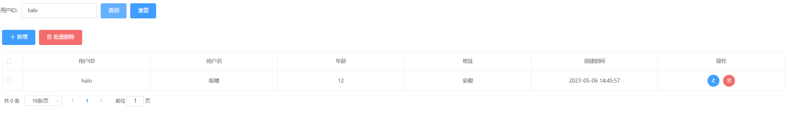
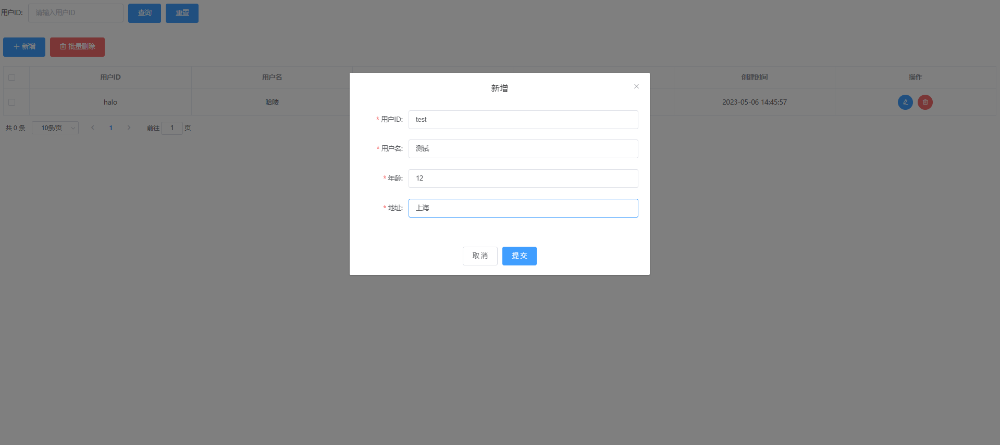
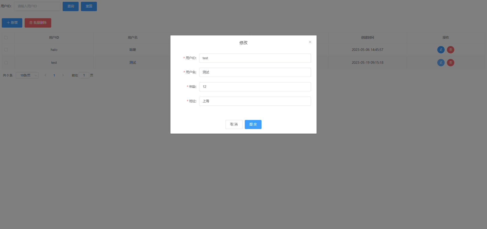
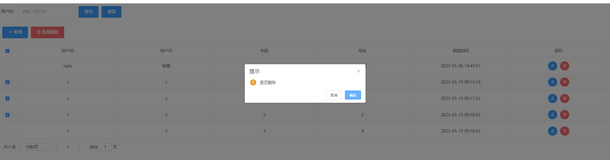

# vue-table-ui

该工程提供的是 一个简单的 Vue + Element-UI 的表格，增删改查操作。

工程代码在最下面。

# 环境

- jdk1.8
- idea
- maven
- springboot 2.1.1.RELEASE

# 示例

## 首页

## 查询

## 新增

## 修改 

## 删除

# 官方文档

Element-Ui: https://element.eleme.cn/#/zh-CN/component/installation

Vue : https://cn.vuejs.org/guide/introduction.html

# 项目地址

[xiaoxiao-demo](https://gitee.com/HelloWangXianLin/xiaoxiao-demo )

在【vue-table-ui】工程下,配合layui-table 后端接口使用。

> 麻烦大佬，动动小手，点个小心心，在下感激不尽。